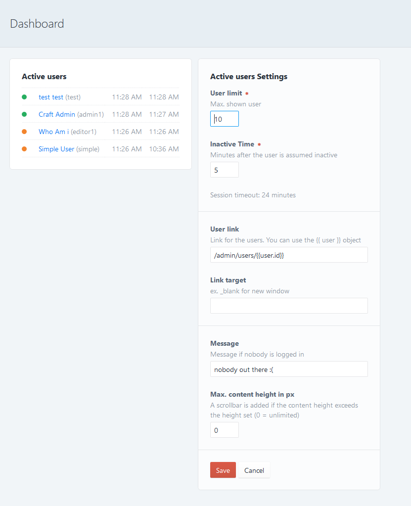

# Activeusers plugin for Craft CMS 3.x

A widget showing active users.

## Requirements

This plugin requires Craft CMS 3.0 or later.

## Installation

To install the plugin, follow these instructions.

1. Open your terminal and go to your Craft project:

        cd /path/to/project

2. Then tell Composer to load the plugin:

        composer require vardump/activeusers

3. In the Control Panel, go to Settings → Plugins and click the “Install” button for activeusers.

## Configuring activeusers

Go to the Dashboard and add a Activeusers Widget. 

You can define a message which is shown if you are the only one online and a time when the user is assumed inactive. 

The widget shows 4 columns : 

1. Indicator 
   
   green -> active
   
   orange -> assumed inactive

2. User firstname, lastname and username
3. Last activity time
4. Login time   

Brought to you by [vardump.de](https://vardump.de)
